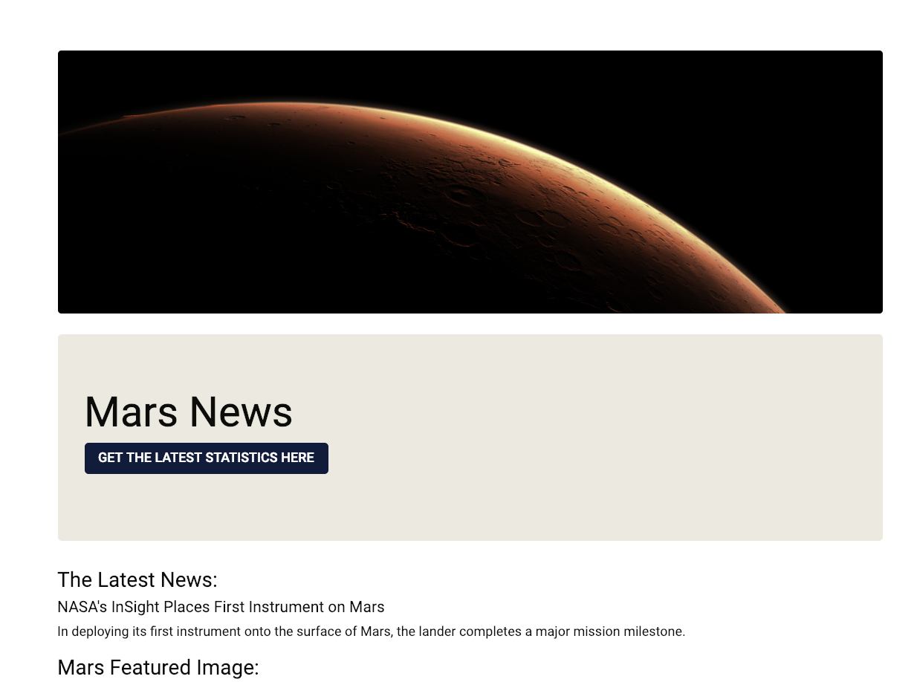

# Web Scraping Mars
## Dynamic, real time browser automation and data collection
Latest news about Mars in a user interface.

### About
NASA publicises data on a varity of platforms, and this project pulls information with the Python Beautiful Soup library from several different websites. 

Data collected from these links:
https://mars.nasa.gov/news/
https://www.jpl.nasa.gov/spaceimages/?search=&category=Mars
https://www.jpl.nasa.gov/
https://twitter.com/marswxreport?lang=en
https://space-facts.com/mars/
https://astrogeology.usgs.gov/search/results?q=hemisphere+enhanced&k1=target&v1=Mars

### Screencast
Movie file called: scrape_recording.mov in root folder 

### Deployment 
Localhost

I did have it deployed on Heroku at one point, but this proved problematic due to website updates breaking the code when they change format. For example, Twitter commonly changes css class names.

Run with "python app.py"  commandline.

### Frameworks
 Python
 Flask
 Bootstrap 4

### File Structure
The directory "mars_webscrape directory" contains scripts and templates

### Results

### Landing Page

